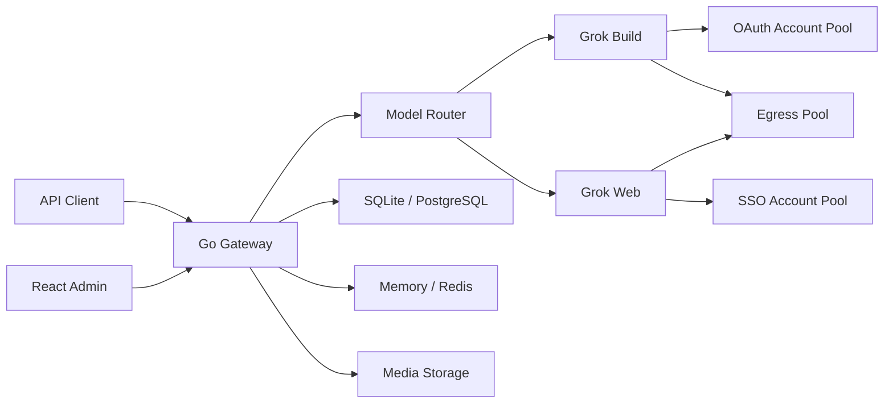

<p align="center">
  
</p>

<p align="center">
  <strong>面向 Grok Build 与 Grok Web 的多账号 API 网关</strong>
</p>

<p align="center">
  <a href="./backend/go.mod"></a>
  <a href="./frontend/package.json"></a>
  <a href="https://github.com/chenyme/grok2api/actions/workflows/docker-publish.yml"></a>
</p>

> [!TIP]
> **个人新项目**<br>
> 推荐个人新项目 [DEEIX-AI：DEEIX-Chat 轻量化 AI 平台](https://github.com/DEEIX-AI/DEEIX-Chat)：企业级模型路由、对话、文件、工具、计费、身份和运维的一体化 AI 平台，全面且极致的低占用，空载运行时仅占用 34 MB。

> [!NOTE]
> 本项目仅供学习与研究交流。请务必遵循 Grok 的使用条款及当地法律法规，不得用于非法用途！

Grok2API 是一个纯 Go 实现的 Grok API 网关。项目将 Grok Build OAuth 与 Grok Web SSO 组织为独立账号池，对外提供 OpenAI 风格接口、Anthropic Messages 兼容接口，以及账号、模型、密钥、用量和代理管理后台。

## 功能概览

- **双 Provider**：`grok_build` 与 `grok_web` 独立路由、额度和故障状态
- **标准接口**：Responses、Chat Completions、Images、异步 Videos、Anthropic Messages
- **多账号调度**：优先级、并发限制、额度门控、会话粘滞、冷却与故障切换
- **账号接入**：Device OAuth、OAuth JSON、SSO JSON、逐行 SSO Token
- **媒体能力**：图片生成、图片编辑、视频生成、图片本地归档与 URL/Base64 返回
- **基础设施**：SQLite/PostgreSQL、Memory/Redis、HTTP 与 SOCKS 代理池
- **安全边界**：AES-256-GCM 凭据加密、客户端密钥哈希、日志脱敏、SSRF 与传输上限
- **管理后台**：Dashboard、账号、模型、客户端密钥、请求审计、接口文档与热加载设置

## 架构



## 快速部署

容器内统一使用 `/app/config.yaml`。首次启动时若该文件不存在，服务会自动生成默认配置；数据库与媒体保存在 `/app/data`，由命名卷持久化。

凭据加密密钥通过环境变量 `GROK2API_CREDENTIAL_ENCRYPTION_KEY` 注入（Base64 编码的 32 字节密钥）。`jwtSecret` 会由该密钥自动派生，无需单独配置。

### Docker Compose

```bash
git clone https://github.com/chenyme/grok2api.git
cd grok2api

export GROK2API_CREDENTIAL_ENCRYPTION_KEY="$(openssl rand -base64 32)"
docker compose pull
docker compose up -d
```

访问 `http://127.0.0.1:8000`，默认管理员账号为 `admin` / `grok2api`。

常用命令：

```bash
docker compose logs -f grok2api
docker compose restart grok2api
docker compose down
```

如需自定义配置，挂载到 `/app/config.yaml` 即可；文件已存在时不会覆盖：

```bash
# docker-compose.yml
volumes:
  - grok2api-data:/app/data
  - ./config.yaml:/app/config.yaml
```

可参考 [`config.example.yaml`](./config.example.yaml) 编写本地配置。

### Docker CLI

```bash
export GROK2API_CREDENTIAL_ENCRYPTION_KEY="$(openssl rand -base64 32)"

docker pull ghcr.io/chenyme/grok2api:latest

docker run -d \
  --name grok2api \
  --restart unless-stopped \
  -p 8000:8000 \
  -e TZ=Asia/Shanghai \
  -e GROK2API_CREDENTIAL_ENCRYPTION_KEY \
  -v grok2api-data:/app/data \
  ghcr.io/chenyme/grok2api:latest
```

查看日志与停止：

```bash
docker logs -f grok2api
docker stop grok2api
docker rm grok2api
```

挂载自定义配置：

```bash
docker run -d \
  --name grok2api \
  --restart unless-stopped \
  -p 8000:8000 \
  -e TZ=Asia/Shanghai \
  -e GROK2API_CREDENTIAL_ENCRYPTION_KEY \
  -v grok2api-data:/app/data \
  -v "$(pwd)/config.yaml:/app/config.yaml" \
  ghcr.io/chenyme/grok2api:latest
```

官方镜像已经包含前端构建产物，管理端与 API 由同一个 Go 服务提供。

### 源码运行

后端：

```bash
export GROK2API_CREDENTIAL_ENCRYPTION_KEY="$(openssl rand -base64 32)"
cd backend
go run ./cmd/grok2api
```

本地首次运行会在仓库根目录自动生成 `config.yaml`（若不存在）。也可先参考示例手动准备：

```bash
cp config.example.yaml config.yaml
```

前端开发服务器：

```bash
cd frontend
pnpm install
pnpm dev
```

前端默认运行于 `http://127.0.0.1:5173`，并将 API 请求代理到 `http://127.0.0.1:8000`。

## 首次使用

1. 使用管理员登录。Docker 默认账号为 `admin` / `grok2api`；源码或自定义配置时使用 `bootstrapAdmin` 中的账号。
2. 在“上游账号”中接入 Grok Build 或 Grok Web 账号。
3. 等待本次额度和模型能力同步完成。
4. 在“模型管理”中确认对外模型名称与启用状态。
5. 在“客户端密钥”中创建 `g2a_` API Key。
6. 使用该密钥调用 `/v1/*`。

首次管理员创建后，建议立即修改管理员密码。`GROK2API_CREDENTIAL_ENCRYPTION_KEY` 必须长期保留且保持不变，更换后已有凭据将无法解密。若未挂载 `/app/config.yaml`，重建容器会重新生成配置文件，但数据库仍在数据卷中，管理员账号不会重复创建。

## 账号来源

| Provider | 认证方式 | 主要能力 |
| :-- | :-- | :-- |
| Grok Build | Device OAuth、OAuth JSON | 原生 Responses、Chat、Messages、Billing、模型同步 |
| Grok Web | SSO JSON、逐行 SSO Token | Chat、Responses、Messages、图片、图片编辑、视频 |

Grok Build OAuth 支持按需续期。Grok Web SSO 不可自动续期，凭据失效后账号会退出可用号池并等待重新授权。

Grok Web 支持账号列表 JSON，也支持每行一个 Token 的快速导入。账号接入接口会等待本批账号的首次额度与模型能力同步完成后再返回结果。

## 模型

Grok Build 模型根据账号能力动态同步，请以管理端模型页或 `GET /v1/models` 为准。

Grok Web 内置模型：

| 模型 | 能力 | 最低等级 |
| :-- | :-- | :-- |
| `grok-chat-fast` | Chat / Responses / Messages | Basic |
| `grok-chat-auto` | Chat / Responses / Messages | Super |
| `grok-chat-expert` | Chat / Responses / Messages | Super |
| `grok-chat-heavy` | Chat / Responses / Messages | Heavy |
| `grok-imagine-image` | Fast 图片生成 | Basic |
| `grok-imagine-image-quality` | Quality 图片生成 | Super |
| `grok-imagine-image-edit` | 图片编辑 | Super |
| `grok-imagine-video` | 视频生成 | Super |

两个 Provider 不会自动跨来源降级。请求只会进入目标模型所属 Provider 的可用账号池。

## API

除健康检查和公开图片外，所有 `/v1` 接口都需要客户端 API Key：

```http
Authorization: Bearer g2a_xxx_xxx
```

| 方法 | 路径 | 说明 |
| :-- | :-- | :-- |
| `GET` | `/healthz` | 存活检查 |
| `GET` | `/readyz` | 就绪检查 |
| `GET` | `/v1/models` | 当前可服务模型 |
| `POST` | `/v1/responses` | Responses JSON / SSE |
| `POST` | `/v1/responses/compact` | Responses compact |
| `GET` | `/v1/responses/{id}` | 查询 Response |
| `DELETE` | `/v1/responses/{id}` | 删除 Response |
| `POST` | `/v1/chat/completions` | Chat Completions JSON / SSE |
| `POST` | `/v1/messages` | Anthropic Messages JSON / SSE |
| `POST` | `/v1/images/generations` | 图片生成 |
| `POST` | `/v1/images/edits` | 图片编辑 |
| `GET` | `/v1/media/images/{id}` | 公开归档图片 |
| `POST` | `/v1/videos/generations` | 创建视频任务 |
| `GET` | `/v1/videos/{request_id}` | 查询视频任务 |

管理端登录后可在 `/docs` 查看当前 Base URL、可用模型以及 cURL、Python 和 JavaScript 示例。开发环境还可以在 `config.yaml` 设置 `server.swaggerEnabled: true`，通过 `/swagger/index.html` 查看公开 API 的 Swagger 文档；生产环境应保持关闭。

最小调用示例：

```bash
export GROK2API_API_KEY="g2a_xxx_xxx"

curl http://127.0.0.1:8000/v1/responses \
  -H "Authorization: Bearer $GROK2API_API_KEY" \
  -H "Content-Type: application/json" \
  -d '{
    "model": "grok-chat-auto",
    "input": "用三句话解释量子隧穿",
    "stream": true
  }'
```

## 配置与存储

启动配置保存在 `config.yaml`。容器内路径为 `/app/config.yaml`，本地源码运行为仓库根目录 `config.yaml`。

| 分组 | 说明 |
| :-- | :-- |
| `server` | 监听地址、请求体上限、请求生命周期与 Swagger 开关 |
| `frontend` | 公开 API 地址与静态前端目录 |
| `database` | SQLite 或 PostgreSQL |
| `runtimeStore` | Memory 或 Redis |
| `auth` | 管理员 Token 与安全 Cookie |
| `secrets` | 凭据加密密钥；`jwtSecret` 由其自动派生 |
| `bootstrapAdmin` | 首次创建管理员的账号密码 |
| `provider` | Build/Web 上游默认配置 |
| `media` | 媒体存储驱动与路径 |

环境变量：

| 变量 | 说明 |
| :-- | :-- |
| `GROK2API_CREDENTIAL_ENCRYPTION_KEY` | 凭据加密主密钥（推荐）。可用 `openssl rand -base64 32` 生成 |

账号、模型、额度、审计、客户端密钥、媒体任务和运行设置始终保存在关系型数据库。Redis 用于限流、并发租约、粘滞路由、分布式锁、额度恢复事件和多实例设置通知。

推荐组合：

| 场景 | 数据库 | 运行态 | 媒体 |
| :-- | :-- | :-- | :-- |
| 本地或单实例 | SQLite | Memory | 本地目录 |
| 多实例 | PostgreSQL | Redis | 共享卷或实例亲和 |

可热加载的 Provider、批量任务并发、路由、媒体容量、审计和代理参数统一在管理端 `/settings` 修改，不需要直接编辑数据库。导入同步、账号转换、数据同步和凭据刷新默认并发均为 `25`，可分别限制为 `1–50`，并支持随机启动延迟；多实例使用 Redis 时，分类上限和总上限均在集群范围内生效。

## 生产部署

- 使用 HTTPS，并设置 `auth.secureCookies: true`
- 保持 `server.swaggerEnabled: false`
- 通过环境变量或挂载 `/app/config.yaml` 固定 `GROK2API_CREDENTIAL_ENCRYPTION_KEY`
- 修改默认管理员密码，不要继续使用 `grok2api`
- 多实例部署使用 PostgreSQL 与 Redis
- 本地媒体目录在多实例下必须使用共享卷或实例亲和
- 持久化备份 `config.yaml`、关系型数据库和媒体目录
- 不要将 OAuth、SSO、Cloudflare Cookie 或账号导出文件提交到 Git
- 对外暴露前建议配置反向代理、访问日志和基础网络防护

## 开发

后端：

```bash
cd backend
go test ./...
go test -race ./...
go vet ./...
go build ./cmd/grok2api
```

前端：

```bash
cd frontend
pnpm install --frozen-lockfile
pnpm lint
pnpm build
```

## 进一步阅读

- [后端说明](./backend/README.md)
- [前端说明](./frontend/README.md)
- [API 与协议兼容范围](./backend/docs/RESPONSES_COMPATIBILITY.md)
